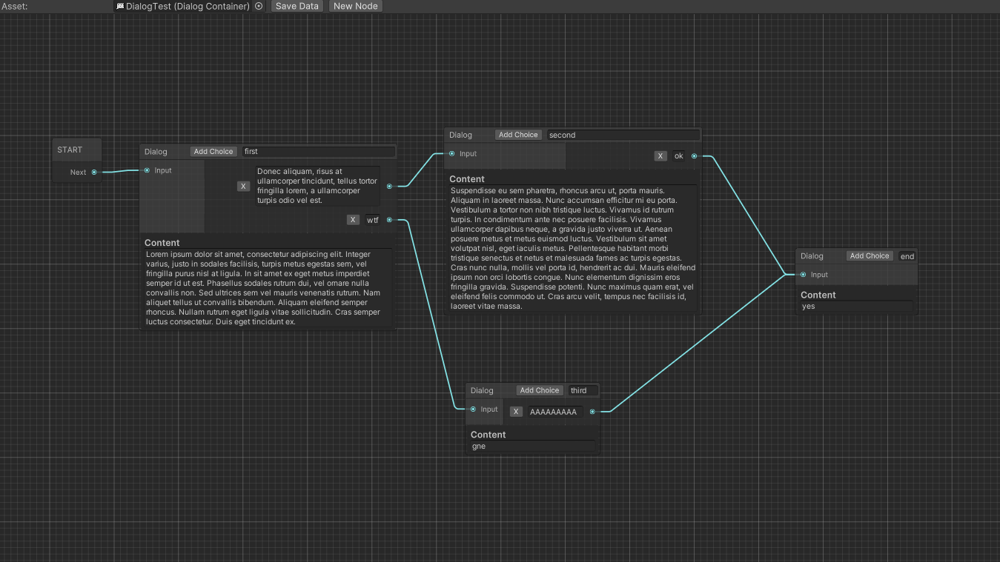

# CheapDialogSystem

A simple dialog system with editor assisted dialog's asset creation. It is orignally based on [this awesome resource](https://github.com/merpheus-dev/NodeBasedDialogueSystem) and I plan on adding things and doing things my own way.

## How to use

The package provide a view to edit/create DialogContainer.asset using graph edition. You can then use those assets as you want using the data they hold. You can find the graph winow in `Window -> CheapDialogSystem -> DialogGraph` :

In the upper toolbar there is an object selector, you can drag your DialogContainer asset in there to edit it, then you can press `Save Data`.

## Current road map

- [ ] Improve dialog graph editor with colors and better asset selector
  - [X] Asset selector
- [ ] Modular conditional dialog branch
- [ ] Modular action during dialog
- [ ] Portraits on dialogs